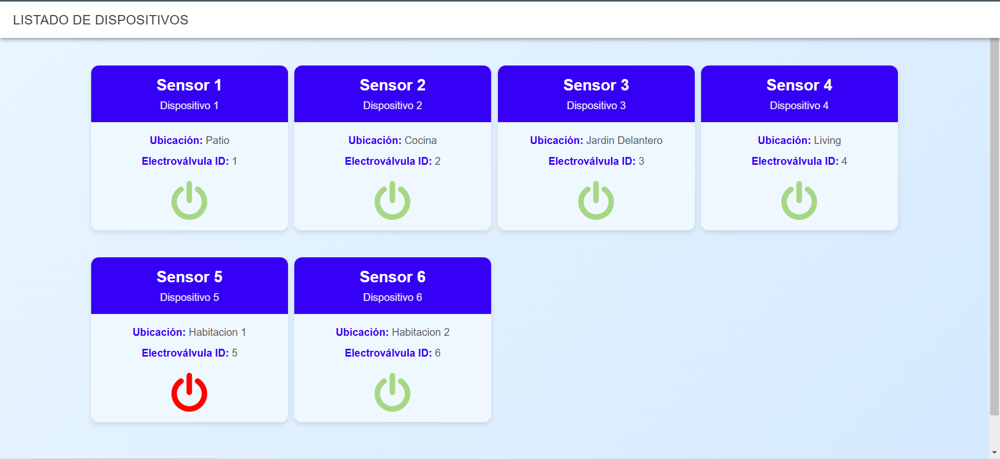
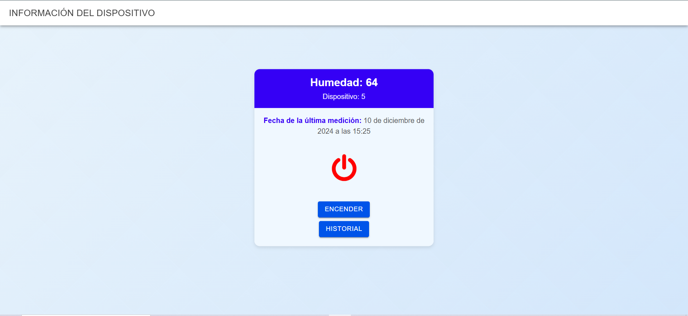
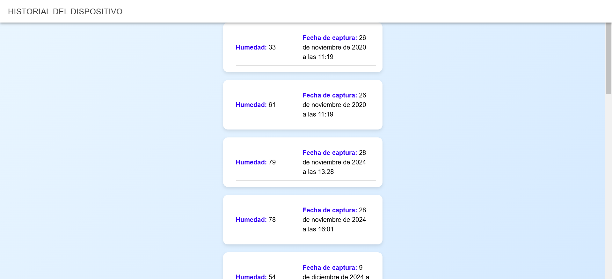

# Proyecto de Monitoreo de Sensores con Ionic Framework

Este proyecto es una aplicación desarrollada en Ionic Framework diseñada para supervisar el estado de una serie de sensores en diferentes ubicaciones. La aplicación proporciona una interfaz intuitiva que permite visualizar el estado actual de los dispositivos, consultar información específica y revisar el historial de mediciones.

## Características principales

### 1. Página principal: Home
- **URL:** `http://localhost:8100/home`
- En esta página se muestra una lista completa de los dispositivos disponibles.
- Cada dispositivo está representado en una tarjeta (*card*) que incluye:
  - Nombre del dispositivo
  - ID del dispositivo
  - Estado (Encendido o Apagado)

 <!-- Imagen 1 de ejemplo -->

### 2. Página de información del dispositivo
- Al seleccionar cualquier tarjeta en la página principal, el usuario es redirigido a una página con detalles específicos del dispositivo.
- En esta página se puede:
  - Ver la última humedad registrada por el sensor.
  - Consultar el estado actual del dispositivo (Encendido o Apagado).
  - Cambiar el estado del dispositivo (Encender o Apagar).
  - Acceder al historial de mediciones de humedad.

 <!-- Imagen 2 de ejemplo -->

### 3. Página de historial de mediciones
- Si se selecciona la opción de historial en la página de información del dispositivo, se muestra una lista con todas las mediciones registradas por el dispositivo.
- Cada registro incluye:
  - Valor de la medición de humedad.
  - Fecha correspondiente a la medición.

 <!-- Imagen 3 de ejemplo -->

Navega por las páginas disponibles para consultar la información de los dispositivos y sus mediciones.

